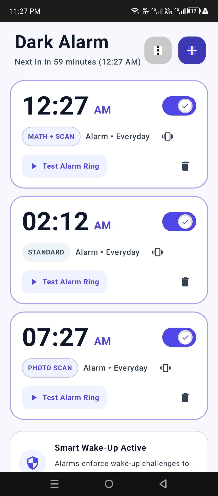
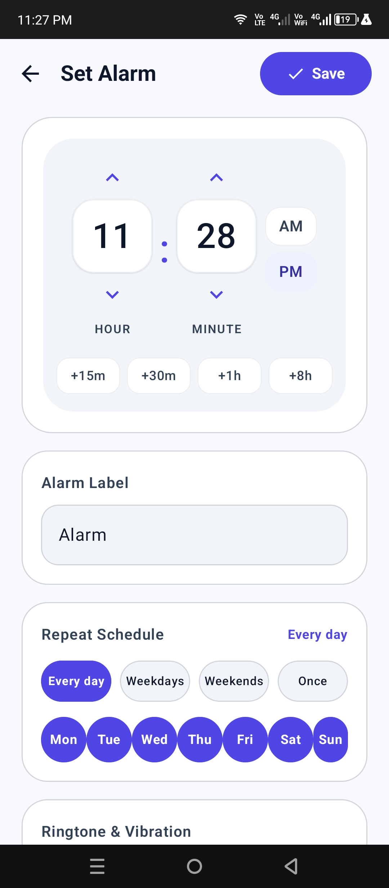
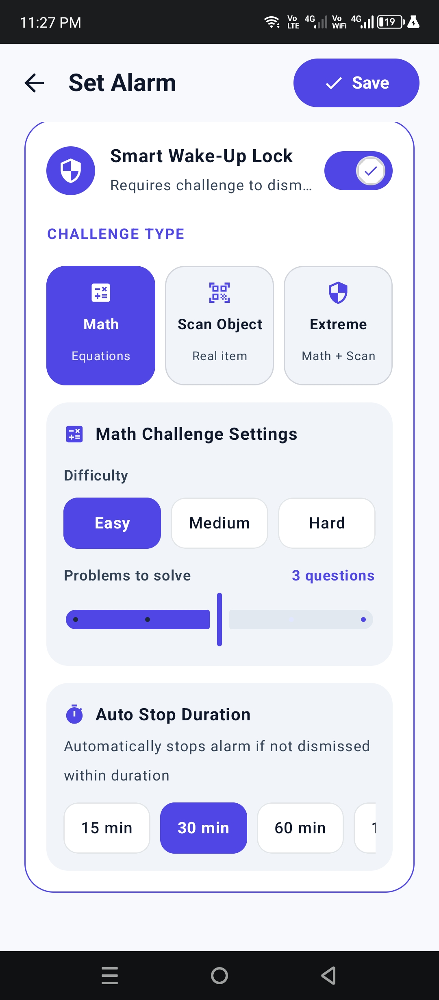
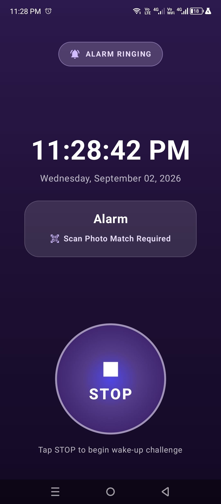
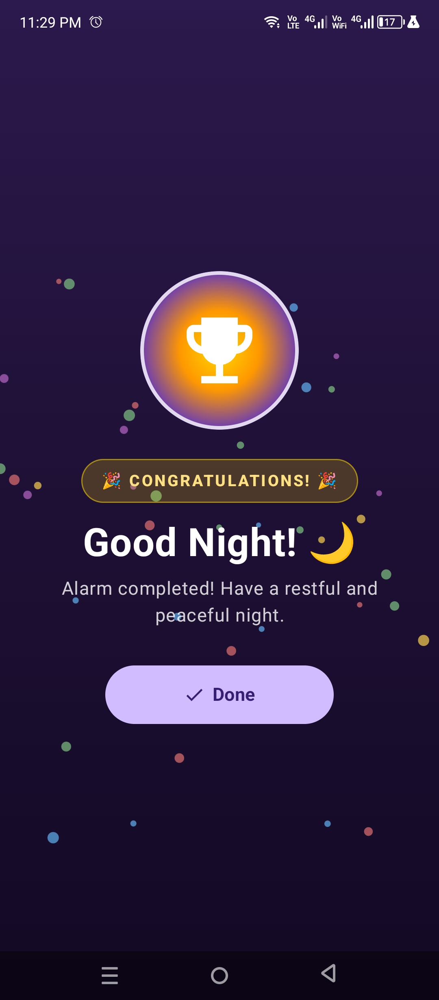

# Dark Alarm

Dark Alarm is a modern, feature-packed alarm clock application for Android, designed to make waking up more reliable and challenging.

## Features

- ⏰ **Custom Alarms & Repeat Schedule**  
  Create alarms with flexible repeat schedules and custom labels.

- 🔊 **Auto Max Volume**  
  Automatically sets the phone's alarm volume to maximum when the alarm starts ringing.

- 🎵 **Custom Alarm Sounds**  
  Choose from built-in alarm sounds or use your own audio.

- 🧮 **Math Challenge**  
  Solve a math problem before dismissing the alarm.

- 📷 **Scan Object Challenge**  
  Scan a selected object with the camera to dismiss the alarm.

- 💪 **Extreme Mode**  
  Requires completing both the **Math Challenge** and **Scan Object Challenge** before the alarm can be dismissed.

## Screenshots

  
  
  

  
  

## App Information

| Information | Details |
|---|---|
| App Name | Dark Alarm |
| Package ID | `com.imalimrans.darkalarm` |
| Version | 2.0 |
| Version Code | 2 |
| Minimum Android | Android 7.0 (API 24) |
| License | GNU General Public License v3.0 |

## Download

The latest APK is available through the project's release page.

## License

Dark Alarm is licensed under the **GNU General Public License v3.0 (GPL-3.0)**.

See the [LICENSE](LICENSE) file for the complete license text.

## Contributing

Contributions, bug reports, and feature requests are welcome.

Please open an issue or pull request in this repository.
